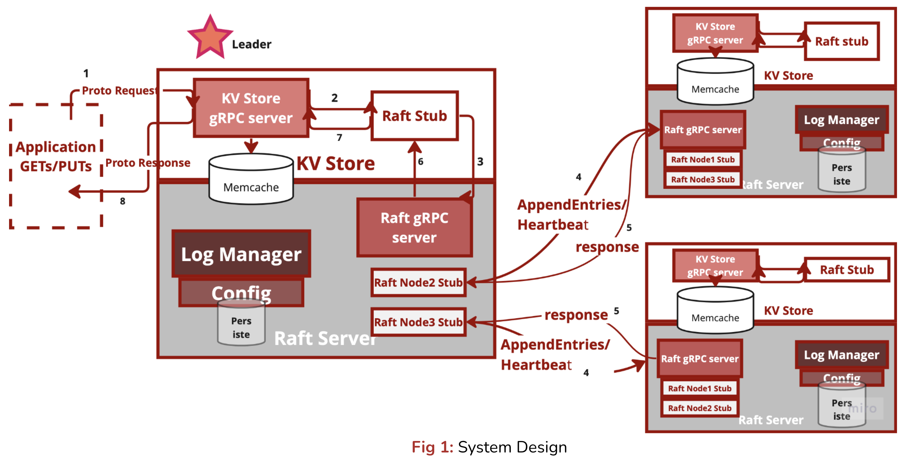
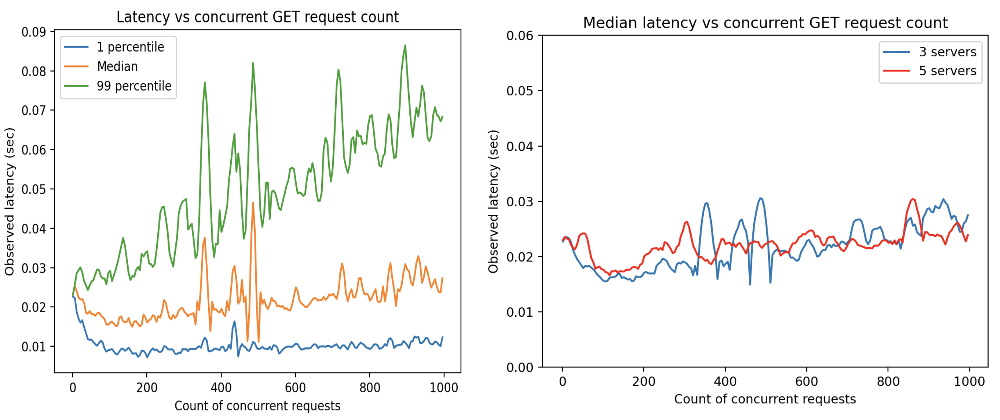
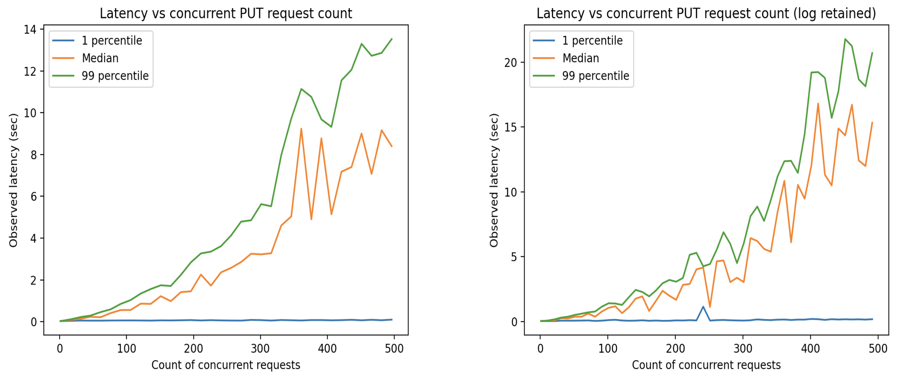

# RAFT KV-Store
Distributed, replicated key-value store built on top of the RAFT protocol built with Python, Docker, gRPC

### Highlights
* Implementation in Python with two database variations - in memory dictionary, and Memcache KV-store
* Docker-ized for deploying multi-node replicated DB
* Separate gRPC servers - KV store(client-accessible) and Raft(internal) APIs.
* Compare and Swap(CAS) for critical section operations.
* Shelve and Pickle library for log serialization and deserialization to disk.

# Architecture

# Performance

